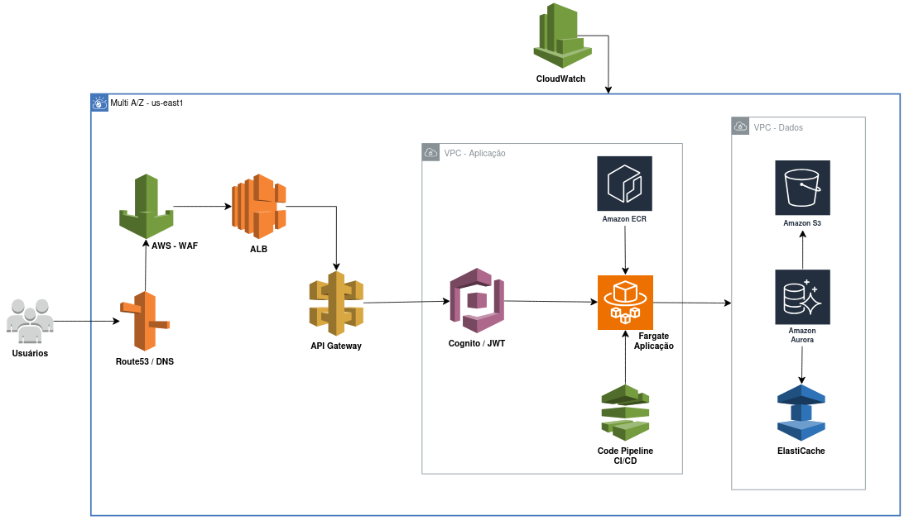

# Documento Técnico – Sistema de Cálculo de Seguro Prestamista

## 1. Visão Geral do Sistema

O sistema de **Cálculo de Seguro Prestamista** tem como objetivo principal 
permitir o cálculo automático do prêmio de seguro vinculado a operações de 
empréstimo, considerando taxas configuráveis e regras de negócio predefinidas.  

Além disso, o sistema deverá permitir a **gestão completa de cotações**, 
incluindo a criação, visualização e exclusão de registros.

---

## 2. Requisitos Funcionais

### 2.1. Cálculo de Seguro Prestamista

O sistema deverá implementar uma lógica para cálculo do **prêmio do seguro 
prestamista** com base nos seguintes parâmetros de entrada:

- **Valor do empréstimo:** valor total solicitado pelo cliente.  
- **Prazo do empréstimo:** em meses.  
- **Prazo do seguro:** em  meses.  
- **Taxa de prêmio sugerida:** percentual aplicado sobre o valor do empréstimo 
(exemplo: **0,02%**).  
- **Taxa de corretagem:** percentual aplicado sobre o prêmio calculado 
(exemplo: **5%**).  

#### 2.1.1. Fórmulas de Cálculo

1. **Cálculo do prêmio:**
   ```
   premio = valor_emprestimo * taxa_premio_sugerida
   ```

2. **Cálculo da corretagem:**
   ```
   corretagem = premio * taxa_corretagem
   ```

3. **Cálculo do total:**
   ```
   total = premio + corretagem
   ```

#### 2.1.2. Cálculo do Pagamento

O sistema devolve os valores nas seguintes modalidades:

- **Pagamento total:**  
  Valor total calculado (`total`).

- **Pagamento à vista:**  
  Atualmente devolve o valor (`total`), porém pode ser ajustado para outro
  valor, por exemplo, com desconto em relação ao valor (`total`).

- **Pagamento parcelado:**  
  O valor total será dividido pelo prazo do empréstimo em meses.  
  ```
  valor_parcela = total / prazo
  ```

#### 2.1.3. Exemplo de Cálculo

| Parâmetro | Valor |
|------------|--------|
| Valor do Empréstimo | R$ 10.000,00 |
| Taxa de Prêmio Sugerida | 0,02% |
| Taxa de Corretagem | 5% |
| Prazo | 12 meses |

**Cálculos:**
```
taxa premio = 10.000 * 0,0002 = 2
premio = 10.000 * 2 = 20.000
corretagem = 20000 * 0,05 = 1000
total = 20.000 * 1.000 = 21.000 
valor_parcela = 21.000 / 12 = 1.750
```

**Resultado:**
- Valor à vista: **R$ 21.000,00**
- Valor parcelado: **R$ 1.750,00** 

---

### 2.2. Gestão de Cotações

O sistema permiti a **gestão de cotações** de seguros prestamistas com 
as seguintes funcionalidades:

#### 2.2.1. Criar Cotação
- Permitir a criação de uma nova cotação informando:
  - Nome do cliente  
  - Email
  - Valor do empréstimo  
  - Prazo do empréstimo

#### 2.2.2. Visualizar Cotações
- Permitir a consulta das cotações cadastradas.
- Exibir informações como:
  - Nome usuário do cliente relacionado as cotações  
  - Identificador da cotação (`id`)  
  - Valor do total 
  - Valor à vista
  - Valor parcelado  

#### 2.2.3. Excluir Cotação
- Permitir a exclusão de uma cotação existente relacionada ao cliente. 

---

## 3. Requisitos Não Funcionais

| Categoria | Descrição |
|------------|------------|
| **Persistência** | Os dados são ser armazenados em uma base de dados relacional, com suporte a JPA/Hibernate. |
| **Interface** | O sistema é acessado via API REST, retornando dados em formato JSON. |
| **Linguagem e Frameworks** | Java 21, Spring Boot, Spring Data JPA. |
| **Escalabilidade** | O sistema permiti inclusão futura de novos tipos de seguro, taxas e regras de cálculo. |
| **Segurança** | Acesso as funcionalidades de **gestão de cotações** estão restritas as requicições com token JWT.

---

## 4. Iniciando a aplicação localmente 

### **Atenção:** 
As portas locais 3306 e 8080, devem estar disponíveis para o
banco de dados e aplicação, respectivamente.

### 4.1. Via Docker 

#### 4.1.1 Pre-requisitos

- Docker 28+, instalado.
- Docker Compose, instalado.
- Make, desejável sua instalação, mas não obrigatória.

#### 4.1.2 Execução 

A forma mais simples de executar a aplicação é através do docker compose, para 
isso basta entrar na pasta raiz do projeto e rodar o comando abaixo:

``
make docker-up
``

ou 

``
sudo docker compose up --build
``

Esses comandos inicializarão os containers do banco de dados MySQL e da 
aplicação, conforme o exemplo abaixo:

| CONTAINER ID  | IMAGE               | COMMAND                 | CREATED        | STATUS               | PORTS                                                        | NAMES        |
|---------------|---------------------|-------------------------|----------------|----------------------|--------------------------------------------------------------|--------------|
| 411085e6b3f2  | seguro-app          | "java -jar seguro.jar"  | 2 hours ago    | Up 2 hours           | 0.0.0.0:8080->8080/tcp, [::]:8080->8080/tcp                  | seguro_app   |
| 21ca5e540c5b  | mysql:8.0           | "docker-entrypoint.s…"  | 2 hours ago    | Up 2 hours (healthy) | 0.0.0.0:3306->3306/tcp, [::]:3306->3306/tcp, 33060/tcp       | mysql_db     |

Para confirmar execute o comando a seguir:

``
sudo docker ps
``

### 4.2. Compilando o código 

#### 4.2.1 Pre-requisitos

- Java 21
- Maven 3.9+ 
- MySQL 8+
- Make, desejável sua instalação, mas não obrigatória.

Acessar a instância do banco de dados e cria o banco de dados da aplicação:

``
mysql> create database seguro;
``

A aplicação está configurada para utilizar os usuário `root` com a senha
`root`, caso deseje alterar, será necessário modificar no arquivo
`application.yml` do projeto. 

#### 4.2.2 Execução 

Para executar a aplicação, acesse a pasta raiz do projeto e execute o comando 
abaixo:

``
make run 
``

ou 

``
mvn spring-boot:run
``
## 5. Execução dos testes

Acessar a pasta raiz do projeto e executar o comando abaixo:

``
make test
``

ou

``
mvn clean test
``

## 6. Executando a aplicação (Chamada dos endpoints REST) 

O fluxo da execução da aplicação é composto da seguinte forma:

1. Criação do usuário, retorna o token que será utilizado nos endpoints de
***gestão de cotação***.
2. Criar, criar uma cotação de acordo com os parâmetros informados.
3. Listar, lista uma ou mais cotações, associadas ao usuário do token, se não 
existir retorna uma lista vazia.
4. Excluir cotação, excluí cotação vinculada ao usuário do token e o id associado.

## 7. Documentação da API

A documentação da API está disponível em:

[Swagger UI](http://localhost:8080/api/docs/swagger-ui-custom.html)

Através dela é possível executar as chamadas aos endpoints.

Algumas ferramentas como o Postman, permitem a importação da documentação para
geração de coleções com as chamadas aos endpoints, para isso utilize essa url:
[http://localhost:8080/api/docs](http://localhost:8080/api/docs)

## 8. Melhorias 

Abaixo são relacionadas algumas melhorias que podem ser feitas:

- Utilizar o Bean Validation para validar as entradas do request.
- Implementação de Value Objects, para casos como do tipo email.
- Implementar o Error Handling do Spring Boot.
- Utilizar o Flyway para gestão de migração (`migration`) do banco de dados.
- Não expor o id do banco de dados.
- Implementar HATEOS para os endpoints.
- Durante a criação da senha, validar requisitos mínimos, como tamanho, 
caracteres e etc. 
- Implementação de testes de aceitação e contrato da API. 

## 9. Arquitetura



### 9.1. Resumo 

- ***Route53 DNS***, utilizado para resolução DNS, para aplicação e para os 
serviços como banco de dados.
- ***AWS WAF***, regras para bloqueio de uso indevido da API, exemplos:
*SQL Injection (SQLi)*, *Cross Site Scripting (XSS)*, *Distributed Denial of
Service (DDoS)*. 
- ***ALB - Load Balance***, balanceamento de carga entre os recursos.
- ***API Gateway***, desacopla a aplicação do acesso direto do cliente,
direcionamento para os recursos da aplicação, transformação do *request/response*.
- ***Cognito***, substituir o gerenciamanto de autenticação com JWT da aplicação
pela solução da AWS, isso permite que aplicação mantenha apenas a 
responsabilidade relacionada ao negócio, novas aplicações poderão fazer uso da
solução no Cognito.
- ***ECS Fargate***, solução para aplicações conteineirizadas, auto escalável,
tem um custo maior que EC2, mas o gerenciamento de infraestrutura é reduzido.
Uma alternativa ao Fargate seria o uso de cluster ***Kubernetes*** através do
***EKS***, mas tem um custo de gerenciamento maior e time especializado em 
Kubernetes.
- ***ECR***, serviço privado de registro de imagens docker.
- ***Code Pipeline***, para a automatização do pipeline de CI/CD.
- ***Amazon Aurora***, banco de dados distribuído, multi-az.
- ***Elastic Cache***, cache das listagem de cotações, para reduzir o volume de
chamadas ao banco de dados relacional, durante períodos de muitos acessos de 
leitura, os dados poderão ficar desatualizados durante alguns períodos, por isso
é importante a definição de regras de invalidação do dado do cache, por exemplo,
LRU (Least Recently Used) e sincronização com base relacional.
- ***S3***, para *backup* da base de dados e também dos dados de observabilidade
da aplicação e infraestrutura. S3 permite a definição de cíclo de vida dos dados, 
permitindo redução de custos com esses dados.
- ***VPC***, vpcs distintas entre a infraestutra da aplicação e a da camada de
dados, aumentado o isolamento e segurança entre elas.
- ***CloudWatch***, para observabilidade da aplicação e infraestrutura.

### 9.2. Conclusão

### Conclusão

A arquitetura proposta visa atender aos requisitos não funcionais do sistema:

- segurança
- escalabilidade
- disponibilidade
- confiabilidade

O **WAF** reforça a **camada de segurança** contra ameaças comuns na web, já o
**Load Balancer (ALB)** promove **balanceamento de carga, tolerância a falhas e 
alta disponibilidade**.

A introdução do **API Gateway** desacopla o cliente dos serviços internos, 
permitindo controle sobre *requests/responses* e integração com políticas de 
segurança e autenticação do **Amazon Cognito**, que centraliza e padroniza a 
**gestão de identidade e autenticação JWT**, melhorando a **confiabilidade** e 
reduzindo a carga de manutenção na aplicação.

Na camada da aplicação, o **ECS Fargate** proporciona **escalabilidade 
automática** e abstrai a complexidade de gerenciamento de infraestrutura, 
garantindo disponibilidade sob demanda. O **ECR** complementa essa solução ao 
oferecer um repositório seguro e privado de imagens Docker, integrando-se ao 
**CodePipeline** para uma esteira de **CI/CD automatizada e confiável**, 
favorecendo práticas de **DevOps** e **entrega contínua**.

Na camada de dados, o **Amazon Aurora** assegura **disponibilidade multi-AZ, 
replicação automática e recuperação rápida de falhas**, fortalecendo a **tolerância 
a falhas e consistência** dos dados. O **Elastic Cache** reduz a carga sobre o 
banco relacional durante picos de leitura, aumentando a **performance e a 
escalabilidade**, enquanto o **S3** oferece armazenamento durável e econômico 
para *backups* e dados de observabilidade, com políticas de ciclo de vida que 
otimizam custos.

A **VPC** segmentada entre camadas de aplicação e dados reforça o **isolamento 
e a segurança da rede**, enquanto o **CloudWatch** fornece **monitoramento 
contínuo e observabilidade** da infraestrutura e da aplicação, permitindo ações 
proativas frente a falhas e anomalias.

Em conjunto, esses componentes formam uma arquitetura **segura, tolerante a falhas, 
escalável e confiável**, mantendo **disponibilidade contínua e resiliência 
operacional**. 

